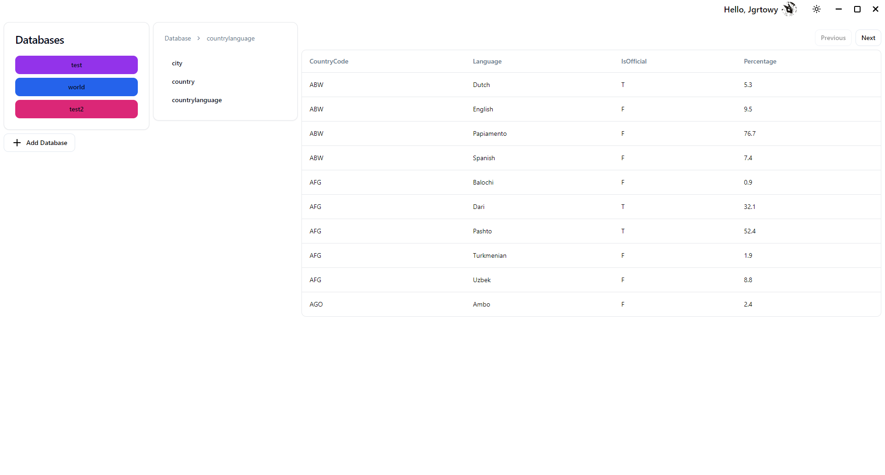

#  PolyBase 
# 🔼⏺️⏹️
### PolyBase is a Multi-dialect database management system made in Electron with:
- Next.js frontend
- Supabase auth and db
- Sequelize & Mongoose ORMs
- shadcn/ui for the UI

### Roadmap: 
- [x] Auth
- [x] Database sync
- [x] Databases display
- [x] Tables and data display
- [ ] MongoDB support
- [ ] Local mode
- [ ] Better UI
- [ ] Data & structure editing
- [ ] Data sorting, searching and filtering

## Prerequisites

1. Install [node.js](https://nodejs.org/)

2. Install [bun](https://bun.sh/)

3. Install dependencies
```bash
$ bun i
```
### Development
```bash
$ bun dev
```

### Building
```bash
$ bun run build
```
<details>
    <summary>Screenshots</summary>
    
    
    
    
</details>

# Feel free to contribute!